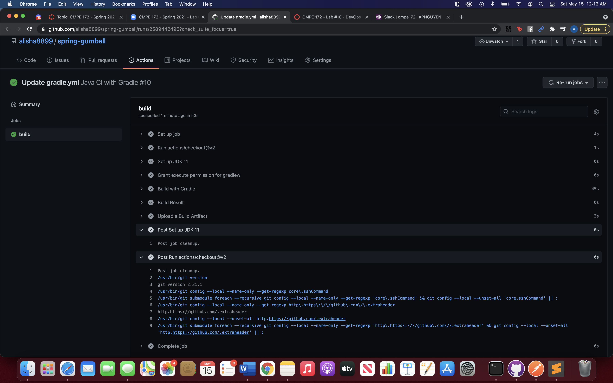

# CMPE 172 - Lab #10 Notes

## CI Workflow (Part 1)

### Screenshots of Part 1

## CD Workflow (Part 2)

### Screenshots of Part 2 

## Notes
I did not encounter any major issues during this lab. I had some issues regarding inserting the private key and the project name into Github, but I was able to figure it out by inserting the entire JSON file for the private key. 
